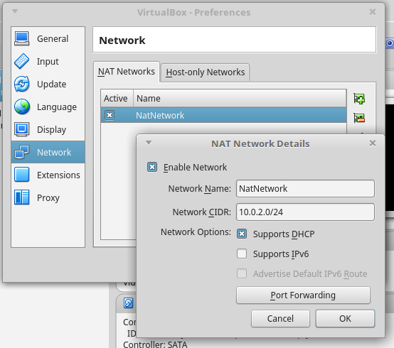
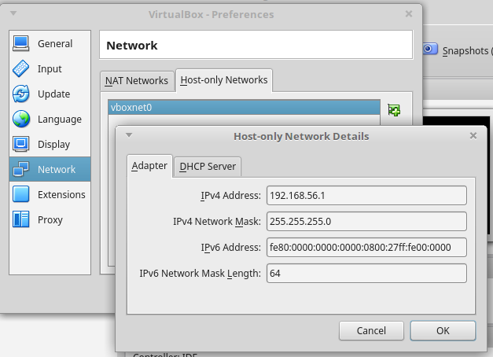
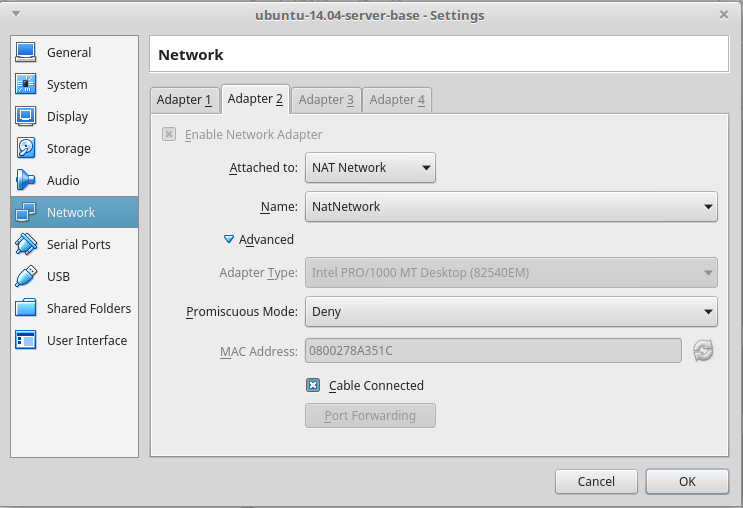
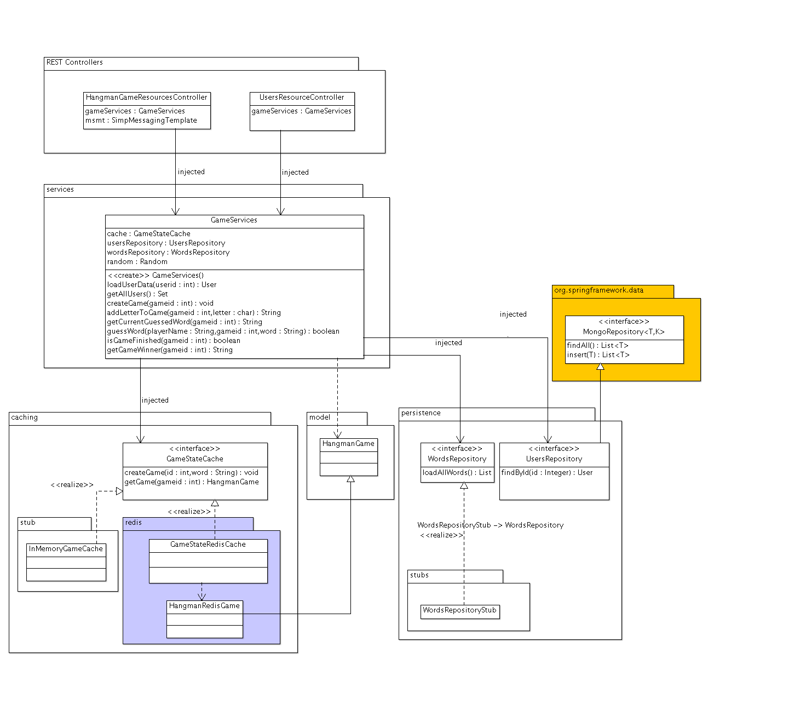
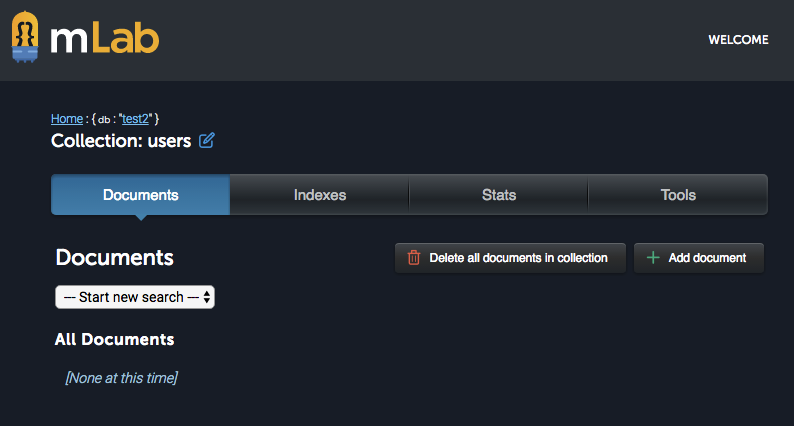
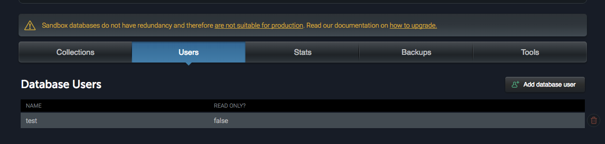
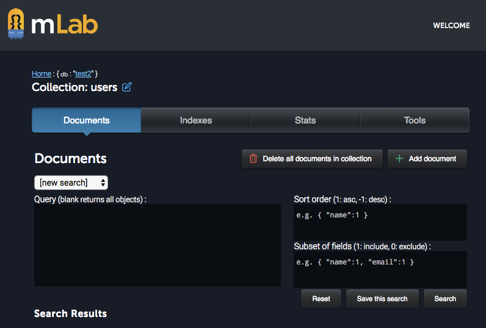

### Escuela Colombiana de Ingeniería
### Arquitecturas de Software

#### Escalamiento con balanceo de carga 
#### Brokers de Mensajería y Balanceadores de carga

En este ejercicio va a crear un esquema de balanceo de carga a través de una red de máquinas virtuales (guest), las cuales sólo serán visibles desde la máquina 'host'.

# Parte 0 - Entorno virtual

1. Importe la máquina virtual suministrada (extensión .ova).
2. Antes de iniciar la máquina virtual, configure las redes de VirtualBox (File/Preferences/Network). Si no está configurada, agregue una red NAT (NatNework) y otra red Host-only Network (vboxnet0)




3. Configure la máquina virtual (Settings/Network) y configure dos adaptadores de red. El primero de tipo 'Host-only' (asociado a la red vboxnet0), y el segundo de tipo NAT-Network (asociado a la red (NatNetwork).




3. Inicie la máquina virtual y autentíquese con   ubuntu / reverse .

4. Configure la máquina virtual para que active el segundo adaptador de red. Para eso, en la máquina virtual edite el archivo /etc/network/interfaces y agregue:

	```text
	auth eth1
	iface eth1 inet dhcp
	```
	
3. Reinicie la máquina y verifique que la máquina tenga salida a Internet. Para esto, haga PING a un servidor desde la máquina virtual.

4. Verifique que la máquina virtual sea accesible desde la máquina real. Revise la dirección IP (la que empieza con 192.168.56.) de la máquina virtual (comando ifconfig), e intente hacer ping desde la máquina real a dicha dirección. 

5. Apague la máquina virtual (sudo shutdown -P 0), y ahora cree un clon de la misma (clic-derecho sobre la máquina virtual  / Clone). No olvide elegir la opción de reiniciar la dirección MAC de los adaptadores de red, y haga un clonado de tipo 'Linked Clone'. Una vez clonado, rectifique que los adaptadores de red de la nueva máquina virtual tiene direcciones MAC diferentes a la máquina original.

7. Inicie ambas máquinas y verifique que queden con sus respectivas direcciones, y que éstas sean accesibles. Una vez verificado esto, puede conectarse a las máquinas virtuales a través de ssh (para no tener que usar la terminal de la máquina virtual):

	```text
	ssh ubuntu@192.168.56.XX
	```

# Parte 1

1. En uno de los dos servidores virtuales, inicie el servidor ActiveMQ. Para esto, ubíquese en el directorio apache-activemq-5.14.1/bin (en el directorio raíz del usuario 'ubuntu'), y ejecute ./activemq start .
2. Para verificar que el servidor de mensajes esté arriba, abra la consola de administración de ActiveMQ: http://IP_SERVIDOR:8161/admin/ (usuario/contraseña: admin/admin) . Consulte qué tópicos han sido creados en el momento.

3. Recupere la última versión del ejericio del 'ahorcado' colaborativo. Modifíquelo para que en lugar de usar el 'simpleBroker' (un broker de mensajes embebido en la aplicación), delegue el manejo de los eventos a un servidor de mensajería dedicado (en este caso, ActiveMQ).

	Es decir, en la configuración en lugar de:
	
	```java
	config.enableSimpleBroker("/topic");
	```
	
	Se configurará como:

	```java
	config.enableStompBrokerRelay("/topic/").setRelayHost("127.0.0.1").setRelayPort(61613);
	```

	Teniendo en cuenta que el parámetro 'relayHost' deberá tener la IP del host donde esté funcionando el servidor de mensajería.
	

4. Modifique, también en la configuración, el registro del 'endpoint', para que permita mensajes de otros servidores (por defecto sólo acepta de sí mismo). Eso es requerido para permitir el manejo del balanceador de carga:

	```nginx
	@Override
    	public void registerStompEndpoints(StompEndpointRegistry registry) {
        	registry.addEndpoint("/stompendpoint").setAllowedOrigins("*").withSockJS();        
	}
	```

5. Modifique el manejador de los eventos interceptados por la aplicación (los que empiezan con /app), para que muestre por consola un mensaje cada vez que se recibe un evento.

6. Agregue las siguientes dependencias al proyecto:

	```
        <dependency>
            <groupId>org.springframework.integration</groupId>
            <artifactId>spring-integration-amqp</artifactId>            
        </dependency>
        <dependency>
            <groupId>io.projectreactor</groupId>
            <artifactId>reactor-core</artifactId>
            <version>2.0.8.RELEASE</version>
        </dependency>    

        <dependency>
            <groupId>io.projectreactor</groupId>
            <artifactId>reactor-net</artifactId>
            <version>2.0.8.RELEASE</version>
        </dependency>    
        <dependency>
            <groupId>io.netty</groupId>
            <artifactId>netty-transport</artifactId>
            <version>4.0.42.Final</version>
        </dependency>                                
        <dependency>
            <groupId>io.netty</groupId>
            <artifactId>netty-transport-native-epoll</artifactId>
            <version>4.0.42.Final</version>
        </dependency>                                

        <dependency>
            <groupId>io.netty</groupId>
            <artifactId>netty-handler</artifactId>
            <version>4.0.42.Final</version>
        </dependency>
	```

6. Copie la aplicación a los dos servidores virtuales (puede usar ssh, o publicarla en un repositorio GIT y luego clonarla desde cada máquina).

7. En cada máquina ejecute la aplicación, y desde el navegador (en la máquina real) verifique que las dos aplicaciones funcionen correctamente (usando las respectivas direcciones IP).

8. Al haber usado la aplicación, consulte nuevamente la consola Web de ActiveMQ, y revise qué información de tópicos se ha mostrado.


# Parte 2

Escoja uno de sus dos servidores como responsable del balanceo de carga. En el que corresponda, cree un archivo de configuración para NGINX

1. Cree un archivo de configuración NGINX (por convención, use la extensión .conf), compatible con WebSockets, a partir de la siguiente plantilla. Ajuste la configuración de 'upstream' para que use el host y el puerto de los dos servidores virtuales, y el parámero 'listen' para que escuche en el puerto 8090 (o cualquier otro, siempre que sea diferente al usado por la aplicación que está en el mismo servidor).

	```nginx
	
	events {
	    worker_connections 768;
	    # multi_accept on;
	}
	 
	http {
	 
	    log_format formatWithUpstreamLogging '[$time_local] $remote_addr - $remote_user - $server_name to: $upstream_addr: $request';
	 
	    access_log   access.log formatWithUpstreamLogging;
	    error_log    error.log;
	
	    map $http_upgrade $connection_upgrade {
	        default upgrade;
	        '' close;
	    } 
	
	    upstream simpleserver_backend {
	    # default is round robin
	        server localhost:8081;
	        server localhost:8082;
	    }
	 
	    server {
	        listen 8000;
	 
	        location / {
	            proxy_pass http://simpleserver_backend;
		    	proxy_http_version 1.1;
	            proxy_set_header Upgrade $http_upgrade;
	            proxy_set_header Connection $connection_upgrade;
	
	        }
	    }
	}
	```

2. Incie el servidor NGINX con:

	```bash
	nginx -c ruta-completa-archivo-configuración
	```

3. Desde un navegador, abra la URL de la aplicación, pero usando el puerto del balanceador de carga (8090). Verifique el funcionamiento de la aplicación.
4. Revise en la [documentación de NGINX](http://nginx.org/en/docs/http/load_balancing.html), cómo cambiar la estrategía por defecto del balanceador por la estrategia 'least_conn'.
5. Ejecute de nuevo la aplicación, pero esta vez abriendo la aplicación desde navegadores diferentes (p.e. Chrome y Firefox), y haciendo uso de la misma.
6. Revise, a través de los LOGs de cada servidor, si se están distribuyendo las peticiones. Revise qué instancia de la aplicación se le está asignando a cada cliente.
7. Apague una de las dos aplicaciones (Ctrl+C), y verifique qué pasa con el cliente que estaba trabajando con el servidor recién apagado.

8. Ajuste la aplicación para que la misma no tenga 'quemadas' datos como el host del servidor de mensajería o el puerto. Para esto revise [la discusión hecha en StackOverflow al respecto.](http://stackoverflow.com/questions/30528255/how-to-access-a-value-defined-in-the-application-properties-file-in-spring-boot)

9. Suba en moodle la nueva versión de la aplicación.\\

# Parte 3

En su ejercicio, haga una rama llamada 'cloud-based-mom'. En ésta, configure su aplicación para que en lugar de usar el servidor JMeter, haga uso del servicio en RabbitMQ en la nube de [CloudAMQP](https://www.cloudamqp.com), el cual también es compatible con STOMP. Para esto:

1. Regístrese en la plataforma y cree una instancia gratuita (Lemur).
2. Abra la consola de configuración, y revise las credenciales de acceso.
3. Abra el [siguiente ejemplo](https://github.com/hcadavid/SpringBoot_WebSockets_CloudBasedRelay_POC) y revise cómo se configuró el 'relay-broker' para usar el servicio de mensajería de CloudAMQP.
4. Ejecute la aplicación y revise su funcionamiento. Acceda a la consola de administración de CloudAMQP y revise qué efectivamente se estén creando los tópicos correspondientes.
5. Consulte 'benchmarks' comparativos entre RabbitMQ y ActiveMQ, y analice cual sería más conveniente.


# Parte 4 (Para el Martes en clase impreso).

1. Haga el diagrama de despliegue (incluyendo el detalle de los componentes de cada servidor) para la versión original del laboratorio.
2. Haga el diagrama de despliegue (incluyendo el detalle de componentes) para la nueva versión del laboratrio. En este caso suponga que los servidores no están en máquinas virtuales sino en máquinas reales.
3. Analice e indique, con la nueva arquitectura planteada qué problemas o inconsistencias se podrían presentar con la aplicación?. Qué solución plantearía al respecto?

### Escuela Colombiana de Ingeniería
### Arquitecturas de Software - ARSW
## Ejercicio - Bases de datos NoSQL - Parte 1 (Llave/Valor)

En este ejercicio se va a retomar la aplicación del 'ahorcado en línea':


Como se observó en el ejercicio anterior, esta aplicación tiene el defecto de guardar datos provisionales (el estado de los 'ahorcados') en un mapa dentro de la memoria del servidor, lo cual crea inconsistencias cuando varias instancias de la misma son montadas bajo un esquema de balanceo de carga.

## Parte I

1. Inicie una de las máquina virtuales Ubuntu trabajada anteriormente, e <!--instale el servidor REDIS [siguiendo estas instrucciones](https://www.digitalocean.com/community/tutorials/how-to-install-and-use-redis), sólo hasta 'sudo make install'. Con esto, puede --> inicie el servidor con 'redis-server'. Nota: para poder hacer 'copy/paste' en la terminal (la de virtualbox no lo permite), haga una conexión ssh desde la máquina real hacia la virtual.
        
2. Como la aplicación aún no tiene la interfaz para crear nuevas partidas, se registrarán unas existentes directamente en Redis. Para esto revise [en la documentación de REDIS](http://redis.io/topics/data-types) el tipo de dato HASH, y la manera como se agregan tablas hash a una determianda llave. Con esto presente, inicie un cliente redis (redis-cli) en su máquina virtual, y usando los comandos respectivos, cree tres 'hash', uno para cada partida, identificados con la clave "game:1", "game:2", "game:3" (o con los identificadores que usted prefiera). A su vez, cada uno de los 'hash' anteriores debe tener: 
	* La palabra completa
	* La palabra que está siendo descubierta (la que tiene un '_' en lugar de los caracteres no adivinados aún).
	* Si el juego fue finalizado o no.
	* El nombre del ganador.


3. Agregue las dependencias requeridas para usar Jedis, un cliente Java para REDIS:

	```xml
        <dependency>
            <groupId>org.springframework.boot</groupId>
            <artifactId>spring-boot-starter-data-redis</artifactId>
        </dependency>                
 	```                               

4. En la ruta src/main/resources agregue un archivo application.yml con la siguiente configuración (DEBE incluír las tabulaciones):

	```yml
    spring:
	    redis:
	        host: 127.0.0.1
	        port: 6379
            #password:
 	```                               
5. Ahora, va a hacer la implementación del 'GameStateRedisCache' siguiendo el esquema planteado en el diagrama anterior, donde:

	* Se creará la clase GameStateRedisCache.
	* Se creará la clase HangmanRedisGame, que heredará y SOBREESCRIBIRÁ todos los métodos de la clase HangmanGame.

6. Haga que a la clase GameStateRedisCache se le inyecte el 'StringRedisTempalte':

 	```java
    @Autowired
    private StringRedisTemplate template;    
 	```    

7. Haga que la clase HangmanRedisGame tenga como atributos adicionales (a los heredados) el identificador de la partida y el 'template' de redis, e incluya un constructor que permita inicializarlos.

8. Redefina todos los métodos heredados de la clase HangmanRedisGame (tryWord, addLetter, etc), para que en lugar de usar los valores almacenados en los atributos, haga uso de los valores almacenados en en caché, teniendo en cuenta el identificador de la partida. Tenga en cuenta [el API de Spring para el manejo del 'template' de Redis para Spring](https://docs.spring.io/spring-data/redis/docs/current/api/org/springframework/data/redis/core/StringRedisTemplate.html):

 	```java
	//consultar el valor en un hash
    String value=(String)template.opsForHash().get(key, property);           
	
	//actualizar el valor en un hash
	template.opsForHash().put(key,property,value)

 	```    

9. Una vez hecho lo anterior, haga que el método getGame() de _GameStateRedisCache_ retorne una instancia de HangmanRedisGame, a la cual se le pase el identificador y el 'template' de Redis.

10. Ajuste las anotaciones para que la aplicación inyecte el esquema de Caché basado en Redis en lugar del basado sólo en memoria.

11. Verifique el funcionamiento de la aplicación (usando sólo una instancia de la misma).

11. Agruegue el manejo de excepciones donde haga falta, para que si se presentan errores al intentar acceder a una llave de Redis (por errores de conexión o porque la llave no existe), las mismas se escalen hasta el API, y se muestren en el cliente a manera de un mensaje de error legible.

12. Actualice la aplicación en el esquema de balanceo de carga, y rectifique nuevamente el funcionamiento. Para esto debe tener una instancia de Redis en una de las máquinas virtuales, y ambas instancias de la aplicación configuradas para hacer uso de la misma.


### Nota - Error de SockJS

En caso de que con la configuración planteada (aplicación y REDIS corriendo en la máquina virtual) haya conflictos con SockJS:<!--, hay dos soluciones alternativas para terminar el ejercicio:-->

<!--1.--> Configurar REDIS para aceptar conexiones desde máquinas externas, editando el archivo /home/ubuntu/redis-stable/redis.conf, cambiando "bind 127.0.0.1" por "bind 0.0.0.0", y reiniciando el servidor con: 

```bash
redis-server /home/ubuntu/redis-stable/redis.conf. 
```

Una vez hecho esto, en la aplicación ajustar el archivo jedis.properties, poner la IP de la máquina virtual (en lugar de 127.0.0.1), y ejecutarla desde el equipo real (en lugar del virtual). ** OJO: Esto sólo se hará como prueba de concepto!, siempre se le debe configurar la seguridad a REDIS antes de permitirle el acceso remoto!. **

<!--2. Usar la misma configuración, hacer la configuración de NGINX del ejercicio anterior. No se debe olvidar agregar (al igual que en el ejercicio anterior) el permiso para aceptar orígenes alternativos:

	```java
	@Override
	public void registerStompEndpoints(StompEndpointRegistry registry) {
		registry.addEndpoint("/stompendpoint").setAllowedOrigins("*").withSockJS();

	}
	```
-->


## Parte II 

Revise: dentro de la implementación hecha (en la clase RedisHangmanGame), se pueden presentar condiciones de carrera. Por qué y cual es la región crítica?.

Para resolver lo anterior, revise [el ejemplo de la sección 9 de este artículo](https://www.javacodegeeks.com/2015/09/spring-data-and-redis.html) cómo implementar un esquema de bloqueo 'optimista' haciendo uso de WATCH y cómo crear transacciones con MULTI. Sin embargo, tenga presente que NO ES POSIBLE ejecutar la lógica hecha en Java (la que analiza qué si hay letras para destapar o no) dentro de la misma. 

Para poder poner operaciones más avanzada dentro de una transacción, es posible agregar _scripts_ en el [lenguaje de programación LUA](https://www.lua.org/manual/5.1/manual.html), y agregar la ejecución de los mismos dentro de una transacción (un 'MULTI') de Redis, tal [como se muestra en la sección 4.11 de la documentación de REDIS](https://docs.spring.io/spring-data/redis/docs/1.4.0.RC1/reference/html/redis.html).

Recuerde que si los elementos del lenguaje Lua son suficientes para realizar la actualización de la palabra, una alternativa es cambiar la representación de la información. Por ejemplo, guardando las palabras, caracter por caracter, en una lista LSET/LGET.


## Parte III

Para finalizar el ejercicio, se va a sustituír el 'bean' (repositorio) encargado de la persistencia de los usuarios del sistema, por uno que realice la misma en una base de datos NoSQL documental. Para esto, se usará el componente 'spring-data' de Spring de acuerdo con el siguiente diagrama:



Para hacer esto:

1. Regístrese y cree una base de datos MongoDB en [mLab](https://mlab.com).

2. En la base de datos, cree una colección para usuarios, y en la misma registre uno o dos documentos compatibles con la entidad 'User' usada en la aplicación

	

	Por ejemplo:

	```javascript
	{
		"_id": 112233,
		"name": "Maria Perez MongoDB",
		"photoUrl": "http://www.your3dsource.com/images/facepic1.jpeg"
	}
	```


3. En su proyecto, agregue la dependencia starter-data-mongodb:

```xml
<dependency>
	<groupId>org.springframework.boot</groupId>
	<artifactId>spring-boot-starter-data-mongodb</artifactId>
</dependency>
```

4. A la clase usuario agregue la anotación @Document (a nivel de clase) para indicar que la misma podrá hacerse persistente en una base de datos documental, agregando la propiedad 'collection' para indicar en qué colección de la base de datos se registrará su documento JSON correspondiente:

	```java
	@Document(collection = "users")
	public class User {
	```

	Adicionalmente, agregue la anotación @Id a aquel atributo correspondiente al identificador del documento:

	```java
		@Id
		private int id;
	```

5. Para que en esta nueva versión de la aplicación en las dependencias a 'UserRepository' se inyecte una implementación de la persistencia usando MongoDB, haga que la interfaz herede de MongoRepository:

	```java
	public interface UsersRepository extends MongoRepository<User, Integer>{
		...
	}

	```

6. Remueva la anotación @Service del 'stub' de UserRepository usado en la versión anterior del ejercicio.

7. Agregue los parámetros de conexión a la base de datos mongodb Tenga en cuenta que el usuario y contraseña NO son los usados para autenticarse en mLabs, sino aquellos creados específicamente para la base de datos:

	. 

* Parámetros (application.yml):

	```yml
    spring:
      data:
        mongodb:
          host: xxxxxx.mlab.com
          port: 37101
          database: xxxxxx
          username: yyyyyy
          password: zzzzzz  	
    redis:
      host: 127.0.0.1
      port: 6379
	```                               


7. La semántica de los componentes de Spring-Data para MyBatis [depende de una convención de nombres tanto de los métodos como de sus parámetros](https://docs.spring.io/spring-data/data-document/docs/current/reference/html/#mongodb.repositories.queries). Teniendo en cuenta esto, cambie el nombre del método usado para buscar un usuario a partir de su identificador (y por ahora elimine los demás métodos, para evitar conflictos):

```java
public User findById(Integer id);   
```

8. Ejecute la aplicación y verifique que la consulta de clientes se haga correctamente.

## Parte IV

Suponga que los usuarios, en adelante, tendrán un puntaje asociado a sus juegos. Por ahora no se implementará el registro de los puntajes en sí, pero sí serán consultados.

1. Agregue al modelo una clase Score, que tenga: fecha de obtencuón puntaje, y valor de puntaje.

2. Haga la clase User tenga una colección de Score.

3. A través de la interfaz de mLab modifique los documentos existentes (usuarios) para que contengan la respectiva colección de puntajes. En las mismas agregue dos o trés puntajes en fechas diferentes.

4. Al Repositorio de Usuarios (UserRepository) agregue un método que permita consultar aquellos usuarios que tengan puntajes mayores que N. Para esto:

* revise [la sintaxis de $elemMatch](https://docs.mongodb.com/manual/reference/operator/query/elemMatch/), y pruebela en la terminal de consultas de mLab:

	

* Revise la sección 6.3.2 [de la documentación de Spring](https://docs.spring.io/spring-data/data-document/docs/current/reference/html/#d0e3309), para agregar operaciones a un repositorio a partir de consultas. Sobre la base de lo anterior, agregue un método al repositorio de usuarios.

Haga que en la vista:

1. Se muestre el último puntaje obtenido por el usuario, una vez consultado.
2. Se muestren los usuarios que han obtenido puntajes mayores a 100.


## Entrega

1. Asegúrese de que la copia del proyecto que entregará quede configurado para funcionar con el middleware de mensajería, el servidor MongoDB en la nube, y el servidor REDIS local.

2. En el directorio raíz de su proyecto, incluya un archivo INSTRUCCIONES.txt, indicando qué llaves se deben tener en el servidor REDIS para el correcto funcionamiento de la aplicación.

3. Comprima y suba el proyecto. No olvide que el ZIP debe incluír copia del repositorio (folder .git).
